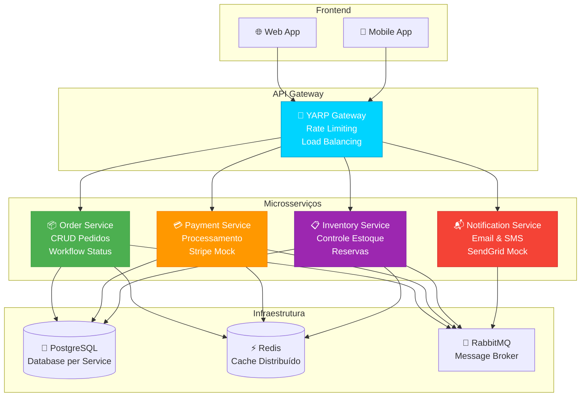
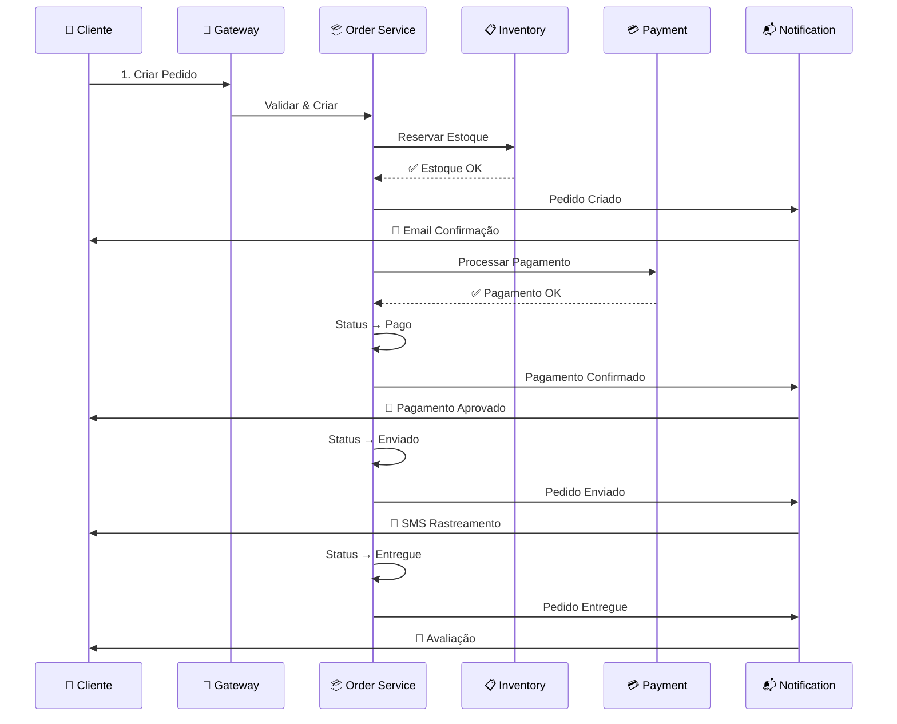
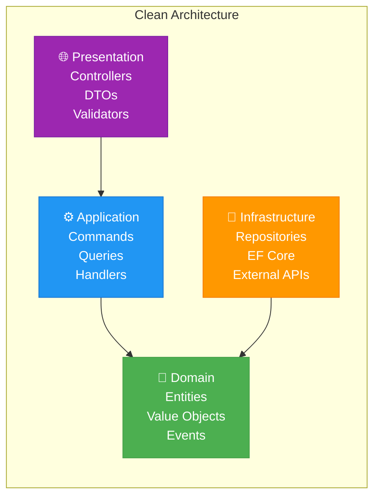

<div align="center">
  
</div>

<div align="center">
  
  
  
  
  
</div>

<br />

<p align="center">
  <strong>Sistema completo de gerenciamento de pedidos construído com .NET 8</strong><br>
  Arquitetura de microsserviços escalável capaz de processar milhares de pedidos por minuto
</p>

## 🚀 Como rodar


### 🐳 Opção 1: Docker (Recomendado)

```bash
# Clone o repositório
git clone <repository-url>
cd OrderManagement

# Sobe tudo de uma vez - bancos, Redis, RabbitMQ e os serviços
docker-compose up -d

# Ou use o script PowerShell (Windows)
.\scripts\run-local.ps1

# Pra parar tudo
docker-compose down
# ou
.\scripts\stop-local.ps1
```

### 💻 Opção 2: Local (pra debug)

```bash
# 1. Suba a infraestrutura primeiro
docker-compose up -d postgres redis rabbitmq

# 2. Rode cada serviço em terminais separados
dotnet run --project src/ApiGateway
dotnet run --project src/OrderService
dotnet run --project src/PaymentService
dotnet run --project src/InventoryService
dotnet run --project src/NotificationService
```

### 🛠️ Opção 3: Scripts Úteis

```bash
# Build e testes
.\scripts\build.ps1

# Testa se a API tá funcionando
.\scripts\test-api.ps1
```

## 📋 Endpoints principais

<div align="center">

| Serviço | Endpoint | Descrição |
|---------|----------|-----------|
| 🚪 **Gateway** | `http://localhost:5000` | Ponto de entrada único |
| 📦 **Orders** | `http://localhost:5001` | Gerenciamento de pedidos |
| 💳 **Payments** | `http://localhost:5002` | Processamento de pagamentos |
| 📋 **Inventory** | `http://localhost:5003` | Controle de estoque |
| 📬 **Notifications** | `http://localhost:5004` | Envio de notificações |

</div>

### 🔍 Swagger UI
Cada serviço tem sua documentação interativa:
- **Gateway**: http://localhost:5000/swagger
- **Orders**: http://localhost:5001/swagger  
- **Payments**: http://localhost:5002/swagger
- **Inventory**: http://localhost:5003/swagger
- **Notifications**: http://localhost:5004/swagger

### 📊 Monitoramento
- **RabbitMQ Management**: http://localhost:15672 (dev/dev123)
- **Health Checks**: Disponível em `/health` em cada serviço

## 🏗️ Arquitetura do Sistema

<div align="center">



</div>

## 🔄 Fluxo de Pedido

<div align="center">



</div>

## 🧪 Testes


```bash
# Roda todos os testes
dotnet test

# Com coverage
dotnet test --collect:"XPlat Code Coverage"

# Só os testes de unidade
dotnet test --filter Category=Unit

# Testa a API funcionando
.\scripts\test-api.ps1
```

## 📚 Documentação

- **[📖 Exemplos de API](docs/api-examples.md)** - Como usar todos os endpoints
- **🔧 Swagger UI** - Documentação interativa em cada serviço
- **📊 Postman Collection** - Coleção completa para testes

## 📦 Stack Técnica

<div align="center">

| Categoria | Tecnologias |
|-----------|-------------|
| **Backend** |   |
| **Database** |   |
| **Messaging** |  |
| **Container** |  |
| **Testing** |   |
| **Patterns** | CQRS, DDD, Repository, Event Sourcing |

</div>

## 🎯 Features Principais

<div align="center">

| Feature | Descrição | Status |
|---------|-----------|--------|
| 📦 **CRUD Pedidos** | Criação, leitura, atualização e exclusão de pedidos | ✅ |
| 🔄 **Workflow Status** | Transições automáticas de status (Pendente → Pago → Enviado → Entregue) | ✅ |
| ⚡ **Cache Distribuído** | Redis para consultas rápidas e invalidação inteligente | ✅ |
| 🛡️ **Rate Limiting** | Proteção contra spam (100 req/min por IP) | ✅ |
| 📊 **Logs Estruturados** | Serilog com formato JSON para análise | ✅ |
| 🔍 **Health Checks** | Monitoramento de saúde de todos os serviços | ✅ |
| 📧 **Notificações** | Email e SMS automáticos para eventos do pedido | ✅ |
| 💳 **Pagamentos** | Integração mock com gateways (Stripe ready) | ✅ |
| 📋 **Controle Estoque** | Reserva e liberação automática de produtos | ✅ |
| 🧪 **Testes** | Cobertura de testes unitários e integração | ✅ |

</div>

## 🏛️ Padrões Arquiteturais

<div align="center">



</div>

### 🎨 Design Patterns Utilizados

- **🎯 CQRS** - Separação de comandos e consultas com MediatR
- **📦 Repository** - Abstração da camada de dados
- **🏭 Factory** - Criação controlada de entidades
- **📢 Domain Events** - Comunicação entre agregados
- **🔄 Event Sourcing** - Histórico imutável de mudanças
- **🛡️ Result Pattern** - Tratamento de erros sem exceptions

## 🚀 Roadmap & Melhorias

<div align="center">

| Fase | Feature | Prioridade |
|------|---------|------------|
| 🎯 **Fase 1** | Autenticação JWT & Autorização | 🔴 Alta |
| 🎯 **Fase 2** | Tracing Distribuído (Jaeger) | 🟡 Média |
| 🎯 **Fase 3** | GraphQL Gateway (HotChocolate) | 🟡 Média |
| 🎯 **Fase 4** | Kubernetes Deployment | 🟢 Baixa |
| 🎯 **Fase 5** | Métricas Prometheus/Grafana | 🟢 Baixa |

</div>

## 🤝 Como Contribuir


1. **Fork** o projeto
2. **Clone** seu fork: `git clone <your-fork-url>`
3. **Crie** uma branch: `git checkout -b feature/nova-feature`
4. **Commit** suas mudanças: `git commit -m 'Add: nova feature'`
5. **Push** para a branch: `git push origin feature/nova-feature`
6. **Abra** um Pull Request

### 📋 Checklist para PRs

- [ ] Código segue os padrões do projeto
- [ ] Testes unitários adicionados/atualizados
- [ ] Documentação atualizada
- [ ] Build passa sem erros
- [ ] Cobertura de testes mantida

## 📊 Estatísticas do Projeto

<div align="center">


</div>

## 📞 Contato & Suporte

<div align="center">

[](mailto:seu-email@exemplo.com)
[](https://www.linkedin.com/in/seu-perfil/)
[](https://github.com/seu-usuario)

</div>

## 📄 Licença

Este projeto está sob a licença MIT. Veja o arquivo [LICENSE](LICENSE) para mais detalhes.

---

<div align="center">

**⭐ Se este projeto te ajudou, deixe uma estrela! ⭐**

<br>

*Feito com ☕ e muito carinho para não virar mais um boilerplate sem alma*

<br>


</div>
